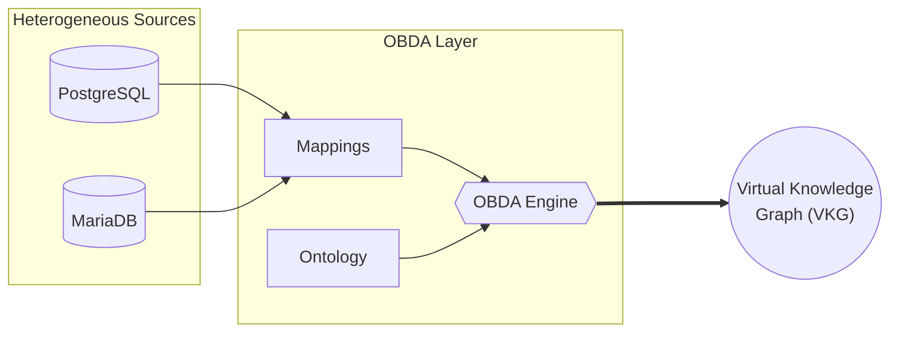

# kg-data-engineer-demo

In this demo, you will learn about Ontology-Based Data Access (OBDA) for data integration.

## What is OBDA?

Ontology-based data access (OBDA, for short) [1] is a semantic technology that provides a layer of abstraction over heterogeneous data sources, allowing users to query the data using a conceptual model (ontology) rather than the underlying data structures.

### Architecture

The diagram above illustrates the core components of an OBDA system:
1. **Heterogeneous Sources**: Data resides in independent, disparate relational databases such as PostgreSQL and MariaDB.
2. **OBDA Layer**: The translation and integration layer consisting of:
   - **Ontology**: A conceptual model describing the domain of interest.
   - **Mappings**: Declarative rules that connect the underlying relational schemas to the vocabulary defined in the ontology.
   - **OBDA Engine**: The core component that uses the mappings and ontology to rewrite queries (e.g., SPARQL) posed over the conceptual model into SQL queries over the source databases.
3. **Virtual Knowledge Graph (VKG)**: The final, unified view of the data. It is considered "virtual" because the data is not duplicated or materialized; it remains at the source and is queried on-demand.

### Ontop

Ontop [2] is a high-performance, open-source OBDA system that functions as a Virtual Knowledge Graph (VKG). It provides a layer of abstraction over heterogeneous relational data sources, allowing users to query the data using a conceptual model (ontology) rather than the underlying data structures.

Key features of Ontop include:
- **Virtual Approach**: The data remains in the original relational databases and is not materialized (copied) into a separate RDF triplestore.
- **SPARQL to SQL Translation**: Ontop translates SPARQL queries expressed over the RDF graph into efficient SQL queries executed against the relational sources.
- **Standards Compliance**: It supports W3C standards like SPARQL, R2RML mappings, and OWL 2 QL ontologies.
- **High Performance**: It employs advanced query rewriting techniques and structural optimizations to quickly generate and execute SQL.

### NPD Benchmark

The NPD benchmark [3] is a specialized benchmark designed to evaluate the performance of Ontology-Based Data Access (OBDA) systems in realistic, industrial settings. It is based on real-world data from the Norwegian Petroleum Directorate (NPD) FactPages, which contains information about petroleum activities on the Norwegian continental shelf.

Unlike generic SPARQL benchmarks, the NPD benchmark focuses on challenges specific to OBDA, such as dealing with complex real-world ontologies, intricate declarative mappings, and large underlying relational databases. It includes tools like VIG (a data scaler) to test system performance as data size increases.

## Demo

See [USER_GUIDE.md](USER_GUIDE.md) for the demo subject.

## References

[1] [Xiao, Guohui, et al. "Ontology-based data access: A survey." International Joint Conferences on Artificial Intelligence, 2018.](https://eprints.bbk.ac.uk/id/eprint/23205/1/OBDA-IJCAI-18.pdf)

[2] [Calvanese, D., et al. "Ontop: Answering SPARQL queries over relational databases. Semantic Web 8 (3), 471–487 (2017).](https://journals.sagepub.com/doi/pdf/10.3233/SW-160217)

[3] [Lanti, Davide, et al. "The NPD benchmark: Reality check for OBDA systems." Advances in database technology-EDBT 2015: 18th International Conference on Extending Database Technology, Brussels, Belgium, March 23-27, 2015, proceedings. University of Konstanz, University Library, 2015.](https://bia.unibz.it/esploro/fulltext/conferenceProceeding/The-NPD-benchmark-Reality-check-for/991005773114601241?repId=12235330170001241&mId=13235268350001241&institution=39UBZ_INST)